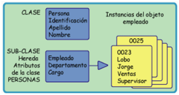

Clasificación de Bases de Datos
===============================

Clasificación de Bases de Datos
---------------------------------

En la actualidad, las empresas manejan una gran cantidad de
datos que debe tener almacenados en una base de datos para poder
consultarlos o modificarlos mediante un producto de software o sistema.
Sin esta funcionalidad, resultaría imposible administrar en su totalidad
los datos que usa la empresa y se perdería mucho tiempo y dinero.

Uno de los pasos cruciales en la construcción de una aplicación que maneje
una base de datos es el diseño de la base de datos, en donde lo más
importante es la correcta elección del Modelo de Datos.

Son muchas las consideraciones a tener en cuenta al momento de hacer el
diseño de la base de datos, entre las que se pueden mencionar:

- La velocidad de acceso

- El tamaño de la base de datos

- El tipo de los datos

- Facilidad de acceso a los datos

- Facilidad para extraer los datos requeridos

Un modelo de datos es un conjunto de conceptos utilizados para
organizar los datos de interés y describir su estructura en forma
comprensible para un sistema informático.

El diseño de bases de datos es el proceso por el que se determina
la organización de una base de datos, incluidos su estructura,
contenido y las aplicaciones que se han de desarrollar.

Un modelo de datos es entonces una serie de conceptos que puede
utilizarse para describir un conjunto de datos y las operaciones
para manipularlos. Hay dos tipos de modelos de datos: los modelos
conceptuales y los modelos lógicos. Los modelos conceptuales se
utilizan para representar la realidad a un alto nivel de abstracción.
Mediante los modelos conceptuales se puede construir una descripción
de la realidad fácil de entender. En los modelos lógicos, las descripciones
de los datos tienen una correspondencia con la estructura física de la
base de datos. En el diseño de bases de datos se usan primero los modelos
conceptuales para lograr una descripción de alto nivel de la realidad, y
luego se transforma el esquema conceptual en un esquema lógico.
El motivo de realizar estas dos etapas es la dificultad de abstraer
la estructura de una base de datos que presente cierta complejidad.

Coincidiendo con la evolución histórica de las bases de datos
éstas han utilizado distintos modelos:

Modelo Jerárquico
~~~~~~~~~~~~~~~~~~~~~~~~~~~~

En el modelo jerárquico los datos se organizan en una
forma similar a un árbol (visto al revés), en donde un
nodo padre de datos puede tener varios hijos. El nodo que
no tiene padres es llamado raíz, y a los nodos que no tienen
hijos se los conoce como hojas.

Modelo de red
~~~~~~~~~~~~~~~~~~~~~~~~~~~~

Este modelo es ligeramente distinto del jerárquico;
su diferencia fundamental es la modificación del concepto
de nodo: se permite que un mismo nodo tenga varios padres.

Modelo Relacional
~~~~~~~~~~~~~~~~~

Es el modelo más utilizado en la actualidad. Almacena los
datos en filas o registros (tuplas) y columnas o campos
(atributos). Estas tablas pueden estar conectadas entre
sí por claves comunes.

Modelo Multidimensional
~~~~~~~~~~~~~~~~~~~~~~~~~~~~

La estructura multidimensional tiene parecidos a la
del modelo relacional, pero en vez de las dos dimensiones
filas-columnas, tiene N dimensiones. Las bases de datos
multidimensionales suelen representarse gráficamente como cubos.

Modelo Orientado a Objetos
~~~~~~~~~~~~~~~~~~~~~~~~~~~~

La estructura orientada a objetos está diseñada siguiendo
el paradigma de los lenguajes orientados a objetos. De este
modo soporta los tipos de datos gráficos, imágenes, voz y
texto de manera natural. Esta estructura tiene gran difusión
en aplicaciones web para aplicaciones multimedia.

Modelo Orientado a Documento
~~~~~~~~~~~~~~~~~~~~~~~~~~~~

Este modelo permite la indexación a texto completo, es decir
que posibilita crear estructuras de datos similares a los
árboles de búsqueda para, en líneas generales, realizar búsquedas
más potentes.

