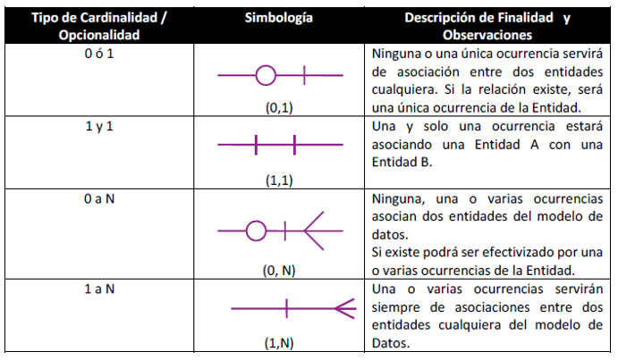

Modelos de base de datos
=========================

Modelo de la relación de entidad (E-R)
--------------------------------------

Caso de Estudio
~~~~~~~~~~~~~~~

Antes de comenzar a desarrollar el tema de modelo de Entidad Relación, vamos a presentar el caso de estudio "Sistema de Gestión de Ventas y Reservas de Entradas para un Complejo de Cines"

#. Un complejo de cines está integrado por varios cines ubicados principalmente en los centros comerciales de la ciudad.

#. Cada cine cuenta con una cantidad de salas, que son las que exhiben las películas en las distintas funciones cinematográficas.

#. La programación de las salas se renueva en forma semanal, existiendo la posibilidad de que algunas salas queden sin uso. Cabe mencionar que no todas las salas tienen la misma capacidad (cantidad de butacas).

#. La programación es la que determina qué películas van a proyectarse y los horarios para cada función de cada una de las salas, para todos los cines. Esta programación se realiza en forma centralizada, desde la administración del Complejo, tomándose como base la información de las películas próximas a estrenar, que envía el INCAA (Instituto Nacional de Cines y Artes Audiovisuales). La programación implica el diseño de las funciones y sus horarios en forma anticipada, debiendo el responsable de la misma, habilitar cada función en el momento que desee permitir la reserva y/o venta de entradas para la misma.

#. La que se le entrega al cliente representa el comprobante de venta y como tal debe cumplir con lo reglamentado en la Ley de Facturación vigente, debiendo contener como datos: nro. de venta, fecha de venta, número de función, sala en la que se proyecta la película, el nombre de la película, fecha y hora de la función, el precio, el tipo de entrada (si es mayor, menor, jubilado) y la calificación de la película, que según especificaciones de la Ley de Cine Nro. 17.741, debe ser informada tanto en la entrada como al inicio de la película. Es importante destacar que la entrada es válida únicamente para la fecha, hora y función indicadas en la misma.

#. Los tipos de entradas y los días y horarios de proyección son los que determinan el precio de la entrada, que también pueden variar en cada cine del complejo. Las funciones admiten ciertos tipos de entradas y otros no, dependiendo de factores como: horarios, calificación de las películas, etc. Por ejemplo: si una película está calificada como para mayores de 16 años, para esa función no se pueden vender entradas de TIPO = MENOR. Cada función tiene asociado un tipo de función, que determina si la función es un pre-estreno, un estreno, una función normal.

Entidades
~~~~~~~~~~

El elemento básico representado por el modelo entidad relación es una entidad, que es una cosa del mundo real con una existencia independiente.

- Una entidad puede ser un elemento con una existencia física (por ejemplo, una persona en particular, un coche, una casa o un empleado) o puede ser un elemento con una existencia conceptual (por ejemplo, una venta, un trabajo o un curso universitario).

- Cada entidad tiene atributos (propiedades particulares que la describen).

Una entidad es una abstracción de un conjunto de cosas del mundo real tal que:

- Las cosas de ese conjunto tienen las mismas características o comportamiento.

- Las cosas de ese conjunto están sujetas y conformes a las mismas reglas.

Las entidades que se tendrán en cuenta al modelar un sistema son aquellas que representan "cosas" de las que el sistema necesita almacenar ciertos datos.

Ejemplo:

El conjunto: {ruleman 8705, tornillo 5 mm, filtro de aire, etc.}

forma la entidad => REPUESTO

Identificación de Entidades
~~~~~~~~~~~~~~~~~~~~~~~~~~~

Para identificar entidades vemos cuál es el sistema que se está analizando
(identificando sus límites) y nos preguntamos:

¿Cuáles son las cosas de este sistema de las que nos interesa tener sus datos?

Para facilitar la identificación de las entidades, debemos tener
en cuenta que existen cuatro categorías, de acuerdo a lo que ellas
representen:

- Cosas tangibles: Artículo, Repuesto, Rodado.

- Roles desempeñados por personas u organizaciones: Cliente, Proveedor, Personal.

- Incidentes: Usado para representar la ocurrencia de un hecho (en un sistema de una compañía de seguros: Siniestros; en una empresa de transporte: Viajes).

- Interacciones: Representan alguna transacción (Compra, Pedido, Venta, Pago).

Es importante una buena elección del nombre dado a una entidad para la
legibilidad y el entendimiento del modelo de datos. Luego de identificar
las entidades, se analizan sus atributos.

Atributos
~~~~~~~~~

Un atributo es una abstracción que identifica características, propiedades
que posee una entidad. Los atributos de una entidad deben ser:

- Completos: capturar toda la información que interesa del objeto, desde el punto de vista del sistema.

- Plenamente elaborados: cada atributo captura un aspecto separado de la entidad.

- Mutuamente independientes: cada atributo debe tomar un valor independientemente de los valores asumidos por otros atributos.

Con respecto a nuestro caso de estudio, podemos identificar la entidad
principal PELICULA y sus atributos, de la siguiente manera:

- Entidad: PELICULA

- Atributos: nombre, titulo original, año de estreno, disponible, duración, fecha de ingreso.

Podemos ver esta entidad representada en un diagrama de entidad-relación de la siguiente manera:

Así podemos tener como ejemplo de entidades PELICULA, a dos instancias de película, con los siguientes atributos:

Película 1: {2013, true, 143, 11/07/2013, "El Gran Gatsby", "The Great Gatsby"}

Película 2: {2014, true, 122, 01/08/2014, "Relatos Salvajes", "Relatos Salvajes"}

Clasificación de Atributos
--------------------------

Atributos descriptivos
~~~~~~~~~~~~~~~~~~~~~~~~~~

Son las características intrínsecas de cada instancia de la entidad; como lo dice su nombre, describen a la entidad, representan sus propiedades. En la entidad película sería los atributos: anio_estreno, disponible, duración, fecha_ingreso, nombre y titulo_original.

Atributo Identificador Único
~~~~~~~~~~~~~~~~~~~~~~~~~~~~

Se denomina identificador a uno o más atributos que identifican unívocamente cada instancia de una entidad; es conocido también como "clave candidata". Es decir, nunca puede existir dos instancias de una entidad con el mismo valor de su atributo identificador. En una entidad puede haber varios atributos posibles para ser elegidos como "identificador".

Por ejemplo, en el caso de una entidad EMPLEADO podríamos tener dos atributos que cumplen con la condición de identificar unívocamente a cada instancia de la entidad: documento y CUIT.

En estos casos, para elegir el atributo identificador debemos tener en cuenta dos reglas:

Que la clave sea mínima: Es decir elegir la alternativa en la que se necesiten menos atributos para conformar la clave.

Elegir el atributo más significativo dentro del dominio del problema que se está modelando.

En el caso de ejemplo mencionado anteriormente, en la entidad Empleado se debe elegir un atributo para que sea identificador, en este caso conviene elegir el CUIT ya que ocasionalmente pueden existir dos personas con el mismo DNI, pero nunca con el mismo CUIT.

Una definición más formal podría ser la siguiente:

“El atributo A, o el conjunto de atributos, de una entidad, es un posible atributo identificador si y solo si satisface dos propiedades:

Unicidad: en cualquier momento dado no existen 2 instancias con el mismo valor de A.

Minimidad: Si A es compuesto (es decir el atributo identificador está formado por más de un atributo) no será posible eliminar ningún componente de A sin destruir la propiedad de unicidad.

Toda entidad tiene por lo menos un atributo como posible atributo identificador. El o los atributos identificadores se señalan con el símbolo "@"(arroba), o de lo contrario con la sigla PK (clave primaria).

Para mejorar el desempeño de la base de datos se recomienda utilizar identificadores numéricos; por lo tanto, si una entidad no posee un atributo identificador numérico, se debería agregar un atributo, comúnmente llamado id (abreviación de identificador) seguido por el nombre de la entidad, como se muestra en la entidad Película, donde podemos observar que si bien el nombre de la película no debe repetirse en el negocio, no es un atributo numérico; como consecuencia es más conveniente agregar uno, de la siguiente manera::
    
    Película 1: {1, 2013, true, 143, 11/07/2013, "El Gran Gatsby", "The Great Gatsby"}

Película 2: {2, 2014, true, 122, 01/08/2014, "Relatos Salvajes", "Relatos Salvajes"}

Este atributo agregado id_película, no es más que un número identificador que crece secuencialmente a medida que se agregan nuevas películas: 1, 2, 3, 4, 5, 6, 7, 8, 9, 10,..n.

Atributo Referencial
~~~~~~~~~~~~~~~~~~~~~~~~~~

Un atributo referencial se utiliza para poder establecer relaciones entre diferentes entidades de un modelo entidad- relación. Se denominan REFERENCIALES ya que hacen referencia al ATRIBUTO IDENTIFICADOR de la entidad con que se relacionan. Se dice que un atributo j, ó un conjunto de atributos, de una entidad B es un atributo referencial si y solo si satisface dos propiedades:

Cada valor j es nulo del todo o no nulo del todo. En caso de ser un atributo compuesto, formado por más de un atributo.

Existe una entidad A con atributo identificador j tal que:

Cada valor no nulo de j es en la entidad B idéntico al valor j en alguna instancia de la entidad A. Es decir que si en B el atributo j tiene valor es porque existe ese mismo valor de j en la entidad A.

Podemos ver un ejemplo relacionado con el caso de estudio del Complejo de Cines, con las entidades: PELICULA y PAIS DE ORIGEN. Se utiliza el símbolo "#" (numeral) para señalar que un atributo es referencial, o de lo contrario con la sigla FK (clave foránea).

Esto se logra de la siguiente manera:

Como podemos ver, la entidad Película se relaciona con la entidad PaisDeOrigen, donde país de origen tiene como atributo identificador, señalado con @, que es: id_pais_de_origen.

La entidad Película tiene un atributo referencial, señalado con #, denominado: id_pais_de_origen, que para cada instancia de película referenciará a un único país de origen.

Por ejemplo:

Si tuviéramos las siguientes entidades en PaisDeOrigen:

País de Origen 1: {1, “Español”, Argentina}

País de Origen 1: {2, “Inglés”, Estados Unidos}

País de Origen 1: {3, “Francés”, Francia}

Entonces la entidad película, tendría en el atributo referencial id_pais_de_origen, el valor 1, que referencia a la instancia Argentina de la entidad PaisDeOrigen, como se ve a continuación:

Película 2: { 1, 2014, true, 122, 01/08/2014, "Relatos Salvajes", "Relatos Salvajes",1}

Reglas de Integridad
--------------------

Existen dos reglas denominadas “Reglas de Integridad” que son generales y se aplican a todo el modelo de datos relacional y que son:

1. Integridad de Entidades: Ningún componente del atributo identificador en una entidad aceptará NULOS (nulo se considera que es inexistente, es decir, ausencia de valor).

Ejemplo:

X Película: {NULL, 2014, true, 122, 01/08/2014, "Relatos Salvajes", "Relatos Salvajes”,1}

√ Película: {2, 2014, true, 122, 01/08/2014, "Relatos Salvajes", "Relatos Salvajes",1}

2. Integridad Referencial: Un modelo de datos no debe contener valores en sus atributos referenciales para los cuales no exista un valor concordante en el (ó los) atributos identificadores en la entidad objetivo pertinente.

Ejemplo:

X Película: {2, 2014, true, 122, 01/08/2014, "Relatos Salvajes", "Relatos Salvajes",4}

No existe en la tabla PaisDeOrigen una instancia con id_pais_de_origen = 4.

√ Película: {2, 2014, true, 122, 01/08/2014, "Relatos Salvajes", "Relatos Salvajes",1}

Relaciones
----------

- Una relación es la abstracción de un conjunto de asociaciones que existen entre las instancias de dos entidades, por ejemplo, existe una relación entre Película y PaisDeOrigen (Ver figura 14).

- Las relaciones tienen sentido bidireccional.

- Las relaciones existen ya que las entidades representan aspectos del mundo real y en este mundo los componentes no están aislados, sino que se relacionan entre sí; es por esto que es necesario que existan las relaciones entre las entidades.

Cardinalidad y Opcionalidad de las relaciones
~~~~~~~~~~~~~~~~~~~~~~~~~~~~~~~~~~~~~~~~~~~~~~~~

- Cardinalidad: Indica para una instancia de una entidad A con cuántas instancias de la entidad B, se relaciona. Las posibilidades son: 0, 1 o muchos, que se representan con O ; | respectivamente

- Opcionalidad: Indica para una instancia de una entidad A, si la relación con instancias de la entidad B, es opcional u obligatoria. Las posibilidades son: 0 o 1 que se representan con O o :code:`|`, :math:`ß`; respectivamente.

Tipos de cardinalidad y opcionalidad
~~~~~~~~~~~~~~~~~~~~~~~~~~~~~~~~~~~~~

**Relación Uno a uno**

Por ejemplo, en el caso de estudio añadiremos las clases que se muestran a continuación para explicar esta relación:

Entonces, si llevamos estas clases a entidades, vemos que: un empleado puede tener o no un usuario y si ese usuario existe, es para un único empleado.

Esto se lee, de la siguiente manera:

“Un empleado puede tener opcionalmente un único usuario o no tener ningún usuario asociado, un usuario está asociado de manera obligatoria a un único empleado”.

**Relación Uno a muchos**

Por ejemplo, una película tiene un único género, pero un género como “Drama” puede estar asignado a muchas películas:

Esto se lee, de la siguiente manera:

“Un género puede estar asignado a muchas películas, pero una película tiene un único género”

**Relación Muchos a Uno**

Por ejemplo, una película tiene muchas funciones asignadas, pero una función es para una única película.

 

ACLARACIÓN: Para los casos anteriores (uno a muchos o muchos a uno) siempre el atributo referencial se debe colocar en la entidad donde está la cardinalidad MUCHOS. Esto se justifica debido a que los atributos deben tener valores atómicos en cada celda, es decir un único valor.

A continuación, se muestran 2 ejemplos para explicar lo mencionado anteriormente:

Caso 1: Relación entre Función y Película, con Función referenciando a Película: en este caso la función tiene una única película asociada porque se proyecta una película por función:

.. image:: img/15-teoria.png

Caso 2: Relación entre Función y Película, con Película referenciando a Función: en este caso como la película puede proyectarse en muchas funciones, deberíamos poner en la columna identificada como #id-funcion, más de un atributo referencias, rompiendo la propiedad de atomicidad de los atributos:

**Relación Muchos a muchos**

Por ejemplo, un personaje puede pertenecer a varias películas, por ejemplo: Harry Potter y la piedra filosofal, Harry Potter y la cámara secreta, Harry Potter y el prisionero de Azkaban… y una película puede tener varios personajes.

En este caso, en donde ambas entidades tienen la cardinalidad muchos, nos encontramos con la limitación de no poder dónde colocar el atributo referencial en ninguna entidad, sin romper la unicidad.

Cuando la relación es de muchos a muchos, la forma de solucionarlo y respetar con la propiedad de unicidad es por medio de la creación de una entidad intermedia, denominada Entidad Asociativa, que relacione un personaje con una película de la siguiente manera:

Como se puede ver en la figura 19, la tabla intermedia creada, PersonajeDePelicula, se encarga de establecer una relación uno a uno, entre un personaje y una película; de esta manera siguiendo con el ejemplo de Harry Potter, tendríamos:

Entidades de Personajes:

{1,“Harry Potter”}

{2,“ Ron Weasley”},

{3,“ Hermione Granger”}

Instancias de la Entidad Pelicula:

{5, 2001, true, 152, 03/03/2001, “Harry Potter y la piedra filosofal”, “Harry Potter and the

Philosopher's Stone”, 1, 3}

{6, 2002, true, 152, 03/06/2002, “Harry Potter y la cámara secreta”, “Harry Potter and the

Chamber of Secrets”, 1, 3}

Instancias de la Entidad PersonajeDePelicula:

{1,5},{ 2,5},{3,5},{1,6},{ 2,6},{3,6}

La siguiente tabla presenta un resumen de la Simbología usualmente adoptada en la construcción de Diagramas de Entidad - Relación para representar relaciones entre entidades:

