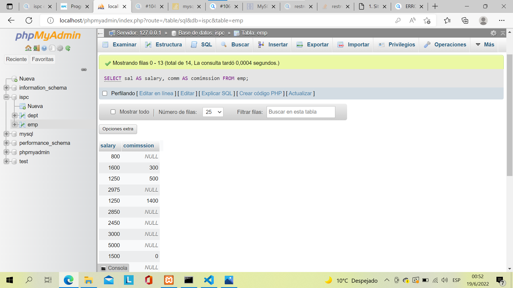
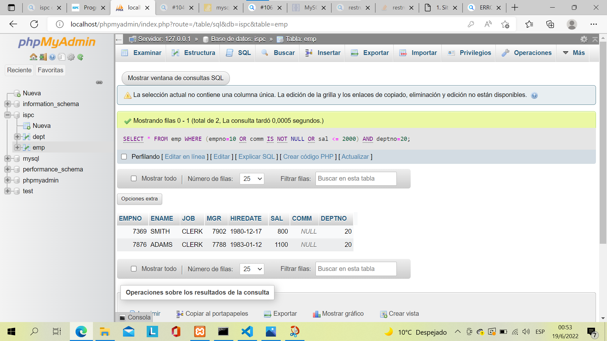
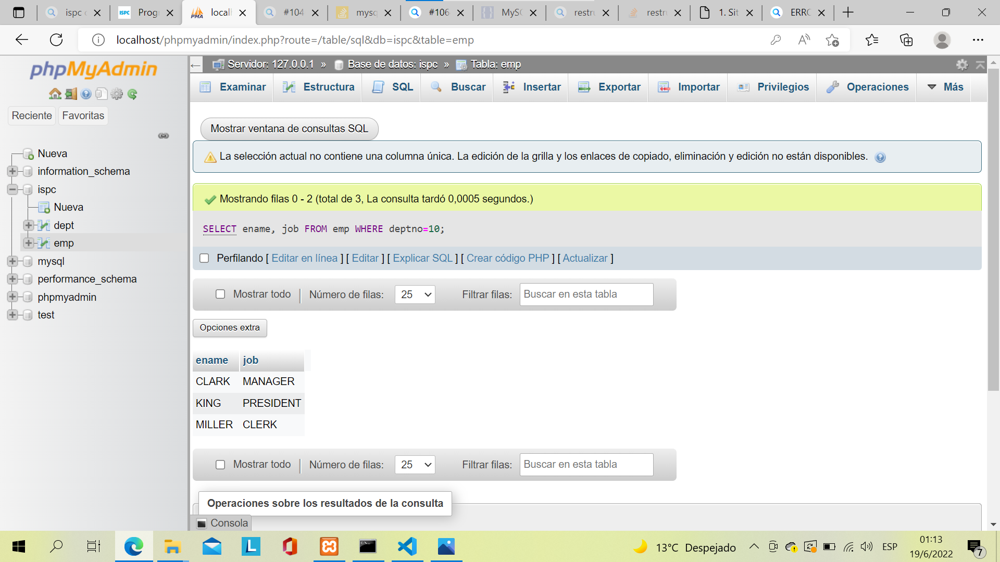

Situacion profesional 1
=======================

Verás varios ítems dentro de las situaciones profesionales 1.n
donde te encontrarás con un problema, vas a poder visualizar la
solución y la posible discusión.

La solución es posible que la encuentres como imagen para que
puedas transcribir en el Gestor de Base de Datos que seleccionaste
para su interpretación. 

Ejemplo a continuación.

.. code-block:: sql

    SELECT * FROM emp;

Recuerda que tienen el Foro de consultas para intercambiar tanto
con docentes como con tus propios compañeros de aula.

Recuperación de todas las filas y columnas de una tabla Problema
----------------------------------------------------------------

Recuperación de todas las filas y columnas de una tabla Problema 
~~~~~~~~~~~~~~~~~~~~~~~~~~~~~~~~~~~~~~~~~~~~~~~~~~~~~~~~~~~~~~~~

Tienes una tabla y quieres ver todos los datos que contiene. 

- Solución

Utilice el carácter especial ``*`` y emita un ``SELECT`` contra la tabla: 

.. code-block:: sql

    SELECT * FROM emp;

- Discusión

El carácter ``*`` tiene un significado especial en ``SQL``.
Su uso devolverá todas las columnas de la tabla especificada.
Dado que no se ha especificado ninguna cláusula ``WHERE``,
también se devolverán todas las filas también. La alternativa
sería listar cada columna individualmente: 

.. code-block:: sql

    SELECT empno, ename, job, sal, mgr, hiredate, comm, deptno FROM emp;

En las consultas ad hoc que se ejecutan de forma interactiva,
es más fácil utilizar ``SELECT *``. Sin embargo, al escribir el
código del programa, es mejor especificar cada columna individualmente.
El rendimiento será el mismo, pero al ser explícito siempre sabrá
qué columnas está devolviendo la consulta. Asimismo, estas consultas
son más fáciles de entender por personas que no sean usted (que
pueden conocer o no todas las columnas de las tablas en la consulta).
Los problemas con ``SELECT *`` también pueden surgir si su consulta
está dentro del código, y el programa obtiene de la consulta un
conjunto de columnas diferente al esperado. En al menos, si se
especifican todas las columnas y faltan una o más, es más probable
que cualquier error arrojado sea error arrojado es más probable que
sea rastreable a la(s) columna(s) específica(s) que falta(n).

Recuperar un subconjunto de filas de una tabla
----------------------------------------------

- Problema

Tiene una tabla y desea ver solo las filas que satisfacen una
condición específica.

- Solución

Utilice la cláusula ``WHERE`` para especificar qué filas conservar.
Por ejemplo, para ver todos empleados asignados al departamento
número 10:

.. code-block:: sql

    SELECT * FROM emp WHERE empno=10;

- Discusión

La cláusula ``WHERE`` le permite recuperar solo las filas que le interesan.
Si la expresión en la cláusula ``WHERE`` es verdadera para cualquier fila,
entonces esa fila se devuelve.

La mayoría de los proveedores admiten operadores comunes como ``=``, ``<``,
``>``, ``<=``, ``>=``, ``!`` Y ``<>``.

Adicionalmente, es posible que desee filas que satisfagan varias condiciones;
esto se puede hacer por especificación colocando ``AND``, ``OR`` y paréntesis,
como se muestra en la siguiente receta.

Encontrar filas que satisfagan múltiples condiciones
----------------------------------------------------

- Problema

Desea devolver filas que satisfagan varias condiciones.

- Solución

Utilice la cláusula ``WHERE`` junto con las cláusulas ``OR`` y ``AND``.
Por ejemplo, si tu quisiera encontrar a todos los empleados
del departamento 10, junto con los empleados que ganan una
comisión, junto con cualquier empleado del departamento 20
que gane como máximo $2.000:

.. code-block:: sql

    SELECT * FROM emp WHERE empno=10 4 OR comm IS NOT NULL OR sal <= 2000 AND depno=20;

- Discusión

Puede usar una combinación de ``AND``, ``OR`` y paréntesis para devolver
filas que satisfagan múltiples condiciones. En el ejemplo de solución,
la cláusula ``WHERE`` encuentra filas como ese:

- El ``DEPTNO`` es 10

- El ``COMM`` no es NULO

- El salario es de $ 2,000 o menos para cualquier empleado en ``DEPTNO`` 20.

La presencia de paréntesis hace que las condiciones dentro de ellos se evalúen juntas. Por ejemplo, considere cómo cambia el conjunto de resultados si la consulta se escribió con el paréntesis como se muestra aquí:

.. code-block:: SQL

    SELECT * FROM emp WHERE (empno=10 OR comm IS NOT NULL OR sal <= 2000) AND deptno=20;

Recuperar un subconjunto de columnas de una tabla
-------------------------------------------------

- Problema

Tiene una tabla y desea ver valores para columnas específicas
en lugar de para todos los columnas.

- Solución

Especifique las columnas que le interesan. Por ejemplo, para ver
solo el nombre, el departamento número y salario de los empleados:

.. code-block:: sql

    SELECT ename, deptno, sal FROM emp;

- Discusión

Al especificar las columnas en la cláusula ``SELECT``, se asegura de
que no haya datos extraños que se retornen. Esto puede ser especialmente
importante cuando se recuperan datos a través de una red, ya que evita
la pérdida de tiempo inherente a la recuperación de datos que no necesita.

Proporcionar nombres significativos para las columnas
-----------------------------------------------------

- Problema

Le gustaría cambiar los nombres de las columnas que devuelve su
consulta para que sean más legibles y comprensibles. Considere
esta consulta que devuelve el salarios y comisiones de cada
empleado:

.. code-block:: sql

    SELECT sal, comm FROM emp;

¿Qué es ``SAL``?, ¿Es una abreviatura de venta (sales)?,
¿Es el nombre de alguien?, ¿Qué es ``COMM``?, ¿Es comunicación?.
Quiere que los resultados tengan etiquetas más significativas.

- Solución

Para cambiar los nombres de los resultados de su consulta, use la palabra
clave ``AS`` en la forma ``nombre_original AS new_name``. Algunas bases
de datos no requieren ``AS``, pero todas lo aceptan:

.. code-block:: sql

    SELECT sal AS salary, comm AS comimssion FROM emp;

Hacer referencia a una columna con alias en la cláusula WHERE
-------------------------------------------------------------

- Problema

Ha utilizado un alias para proporcionar nombres de columna más
significativos para su conjunto de resultados y quisiera excluir
algunas de las filas usando la cláusula ``WHERE``. Sin embargo, tu
intento de hacer referencia a nombres de alias en la cláusula
``WHERE`` falla:

.. code-block:: sql

    SELECT sal AS salary, comm AS comimssion FROM emp WHERE salary < 5000;

- Solución

.. code-block:: sql

    SELECT * FROM
    (SELECT sal AS salary, comm AS comimssion FROM emp) x
    WHERE salary < 5000;

Al ajustar su consulta como una vista en línea, puede hacer referencia
a las columnas con alias:

- Discusión

En este ejemplo simple, puede evitar la vista en línea y hacer
referencia a ``COMM`` o ``SAL`` directamente en la cláusula ``WHERE`` para
lograr el mismo resultado. Esta solución presenta lo que debe
hacer al intentar hacer referencia a cualquiera de los siguientes
en una cláusula ``WHERE``:

#. Funciones agregadas
#. Subconsultas escalares
#. Funciones de ventana
#. Alias

Colocar su consulta, la que da alias, en una vista en línea le
brinda la capacidad de haga referencia a las columnas con alias
en su consulta externa. ¿Por qué necesitas hacer esto? los

La cláusula WHERE se evalúa antes que SELECT; así, SALARY y COMMISSION
aún no existen cuando se evalúa la cláusula WHERE de la consulta "Problema".
Aquellos alias no se aplican hasta que se completa el procesamiento de
la cláusula WHERE. Cómo nunca, la cláusula FROM se evalúa antes que WHERE.
Al colocar la consulta original en una cláusula FROM, los resultados de
esa consulta se generan antes de la cláusula WHERE más externa y la
cláusula WHERE más externa "ve" los nombres de alias. Esta técnica es
particularmente útil cuando las columnas de una tabla no se nombran
particularmente bien.

Concatenar valores de columna
-----------------------------

- Problema

Desea devolver los valores de varias columnas como una sola columna.
Por ejemplo desea producir este conjunto de resultados a partir de
una consulta en la tabla ``EMP``:

    CLARK TRABAJA COMO GERENTE
    
    KING TRABAJA COMO PRESIDENTE
    
    MILLER TRABAJA COMO OFICINISTA

Sin embargo, los datos que necesita para generar este conjunto de resultados provienen de dos columnas diferentes, las columnas ``ENAME`` y ``JOB`` de la tabla ``EMP``:

.. code-block:: sql

    SELECT ename, job FROM emp WHERE deptno=10;

- Solución

Busque y utilice la función incorporada en su SGBD para concatenar
valores de varias columnas.

.. code-block:: sql

    -- DB2, Oracle y PostgreSQ
    -- Estas bases de datos utilizan la barra vertical doble
    -- como operadores de concatenación:
    SELECT ename || ' WORK AS A ' || job as msg FROM emp WHERE deptno=10;

    -- MySQL
    -- Este motor de base de datos soporta una función llamada CONCAT:
    SELECT CONCAT(ename, ' WORK AS A ', job) as msg FROM emp WHERE deptno=10;

    -- SQL SErver
    -- Utilice el operador + para la conactenación:
    SELECT ename + ' WORK AS A ' + job as msg FROM emp WHERE deptno=10;

- Discusión

Utilice la función ``CONCAT`` para concatenar valores de varias columnas.
El ``||`` es un atajo para la función CONCAT en DB2, Oracle y PostgreSQL
mientras que + lo es para SQL Server.
El ``--`` es utilizado para comentar líneas explicativas.