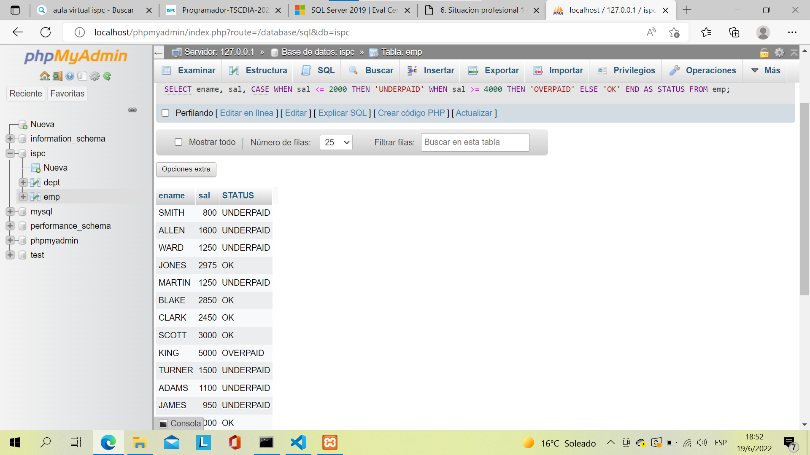
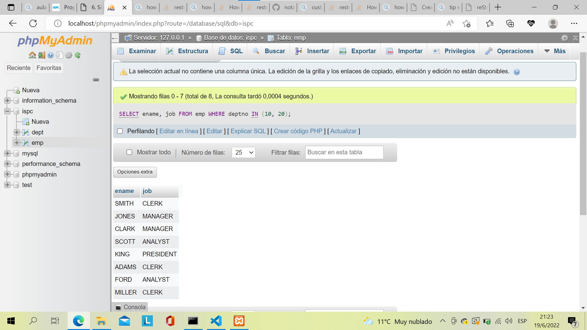
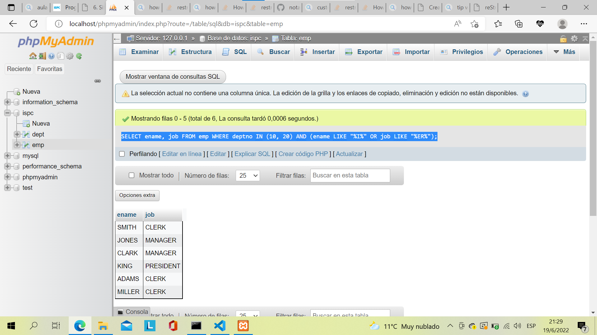

.. role:: underline
    :class: underline

Situacion profesional 1
=======================

Verás varios ítems dentro de las situaciones profesionales 1.n
donde te encontrarás con un problema, vas a poder visualizar la
solución y la posible discusión.

La solución es posible que la encuentres como imagen para que
puedas transcribir en el Gestor de Base de Datos que seleccionaste
para su interpretación. 

Ejemplo a continuación.

.. code-block:: sql

    SELECT * FROM emp;

Recuerda que tienen el Foro de consultas para intercambiar tanto
con docentes como con tus propios compañeros de aula.

Recuperación de todas las filas y columnas de una tabla Problema
----------------------------------------------------------------

Recuperación de todas las filas y columnas de una tabla Problema 
~~~~~~~~~~~~~~~~~~~~~~~~~~~~~~~~~~~~~~~~~~~~~~~~~~~~~~~~~~~~~~~~

Tienes una tabla y quieres ver todos los datos que contiene. 

- Solución

Utilice el carácter especial ``*`` y emita un ``SELECT`` contra la tabla: 

.. code-block:: sql

    SELECT * FROM emp;

- Discusión

El carácter ``*`` tiene un significado especial en ``SQL``.
Su uso devolverá todas las columnas de la tabla especificada.
Dado que no se ha especificado ninguna cláusula ``WHERE``,
también se devolverán todas las filas también. La alternativa
sería listar cada columna individualmente: 

.. code-block:: sql

    SELECT empno, ename, job, sal, mgr, hiredate, comm, deptno FROM emp;

En las consultas ad hoc que se ejecutan de forma interactiva,
es más fácil utilizar ``SELECT *``. Sin embargo, al escribir el
código del programa, es mejor especificar cada columna individualmente.
El rendimiento será el mismo, pero al ser explícito siempre sabrá
qué columnas está devolviendo la consulta. Asimismo, estas consultas
son más fáciles de entender por personas que no sean usted (que
pueden conocer o no todas las columnas de las tablas en la consulta).
Los problemas con ``SELECT *`` también pueden surgir si su consulta
está dentro del código, y el programa obtiene de la consulta un
conjunto de columnas diferente al esperado. En al menos, si se
especifican todas las columnas y faltan una o más, es más probable
que cualquier error arrojado sea error arrojado es más probable que
sea rastreable a la(s) columna(s) específica(s) que falta(n).

Recuperar un subconjunto de filas de una tabla
----------------------------------------------

- Problema

Tiene una tabla y desea ver solo las filas que satisfacen una
condición específica.

- Solución

Utilice la cláusula ``WHERE`` para especificar qué filas conservar.
Por ejemplo, para ver todos empleados asignados al departamento
número 10:

.. code-block:: sql

    SELECT * FROM emp WHERE empno=10;

- Discusión

La cláusula ``WHERE`` le permite recuperar solo las filas que le interesan.
Si la expresión en la cláusula ``WHERE`` es verdadera para cualquier fila,
entonces esa fila se devuelve.

La mayoría de los proveedores admiten operadores comunes como ``=``, ``<``,
``>``, ``<=``, ``>=``, ``!`` Y ``<>``.

Adicionalmente, es posible que desee filas que satisfagan varias condiciones;
esto se puede hacer por especificación colocando ``AND``, ``OR`` y paréntesis,
como se muestra en la siguiente receta.

Encontrar filas que satisfagan múltiples condiciones
----------------------------------------------------

- Problema

Desea devolver filas que satisfagan varias condiciones.

- Solución

Utilice la cláusula ``WHERE`` junto con las cláusulas ``OR`` y ``AND``.
Por ejemplo, si tu quisiera encontrar a todos los empleados
del departamento 10, junto con los empleados que ganan una
comisión, junto con cualquier empleado del departamento 20
que gane como máximo $2.000:

.. code-block:: sql

    SELECT * FROM emp WHERE empno=10 4 OR comm IS NOT NULL OR sal <= 2000 AND depno=20;

- Discusión

Puede usar una combinación de ``AND``, ``OR`` y paréntesis para devolver
filas que satisfagan múltiples condiciones. En el ejemplo de solución,
la cláusula ``WHERE`` encuentra filas como ese:

- El ``DEPTNO`` es 10

- El ``COMM`` no es NULO

- El salario es de $ 2,000 o menos para cualquier empleado en ``DEPTNO`` 20.

La presencia de paréntesis hace que las condiciones dentro de ellos se evalúen juntas. Por ejemplo, considere cómo cambia el conjunto de resultados si la consulta se escribió con el paréntesis como se muestra aquí:

.. code-block:: SQL

    SELECT * FROM emp WHERE (empno=10 OR comm IS NOT NULL OR sal <= 2000) AND deptno=20;

.. image:: img/1-select.png

Recuperar un subconjunto de columnas de una tabla
-------------------------------------------------

- Problema

Tiene una tabla y desea ver valores para columnas específicas
en lugar de para todos los columnas.

- Solución

Especifique las columnas que le interesan. Por ejemplo, para ver
solo el nombre, el departamento número y salario de los empleados:

.. code-block:: sql

    SELECT ename, deptno, sal FROM emp;

- Discusión

Al especificar las columnas en la cláusula ``SELECT``, se asegura de
que no haya datos extraños que se retornen. Esto puede ser especialmente
importante cuando se recuperan datos a través de una red, ya que evita
la pérdida de tiempo inherente a la recuperación de datos que no necesita.

Proporcionar nombres significativos para las columnas
-----------------------------------------------------

- Problema

Le gustaría cambiar los nombres de las columnas que devuelve su
consulta para que sean más legibles y comprensibles. Considere
esta consulta que devuelve el salarios y comisiones de cada
empleado:

.. code-block:: sql

    SELECT sal, comm FROM emp;

¿Qué es ``SAL``?, ¿Es una abreviatura de venta (sales)?,
¿Es el nombre de alguien?, ¿Qué es ``COMM``?, ¿Es comunicación?.
Quiere que los resultados tengan etiquetas más significativas.

- Solución

Para cambiar los nombres de los resultados de su consulta, use la palabra
clave ``AS`` en la forma ``nombre_original AS new_name``. Algunas bases
de datos no requieren ``AS``, pero todas lo aceptan:

.. code-block:: sql

    SELECT sal AS salary, comm AS comimssion FROM emp;

.. image:: img/2-select.png

Hacer referencia a una columna con alias en la cláusula WHERE
-------------------------------------------------------------

- Problema

Ha utilizado un alias para proporcionar nombres de columna más
significativos para su conjunto de resultados y quisiera excluir
algunas de las filas usando la cláusula ``WHERE``. Sin embargo, tu
intento de hacer referencia a nombres de alias en la cláusula
``WHERE`` falla:

.. code-block:: sql

    SELECT sal AS salary, comm AS comimssion FROM emp WHERE salary < 5000;

- Solución

.. code-block:: sql

    SELECT * FROM
    (SELECT sal AS salary, comm AS comimssion FROM emp) x
    WHERE salary < 5000;

Al ajustar su consulta como una vista en línea, puede hacer referencia
a las columnas con alias:

- Discusión

En este ejemplo simple, puede evitar la vista en línea y hacer
referencia a ``COMM`` o ``SAL`` directamente en la cláusula ``WHERE`` para
lograr el mismo resultado. Esta solución presenta lo que debe
hacer al intentar hacer referencia a cualquiera de los siguientes
en una cláusula ``WHERE``:

#. Funciones agregadas
#. Subconsultas escalares
#. Funciones de ventana
#. Alias

Colocar su consulta, la que da alias, en una vista en línea le
brinda la capacidad de haga referencia a las columnas con alias
en su consulta externa. ¿Por qué necesitas hacer esto? los

La cláusula WHERE se evalúa antes que SELECT; así, SALARY y COMMISSION
aún no existen cuando se evalúa la cláusula WHERE de la consulta "Problema".
Aquellos alias no se aplican hasta que se completa el procesamiento de
la cláusula WHERE. Cómo nunca, la cláusula FROM se evalúa antes que WHERE.
Al colocar la consulta original en una cláusula FROM, los resultados de
esa consulta se generan antes de la cláusula WHERE más externa y la
cláusula WHERE más externa "ve" los nombres de alias. Esta técnica es
particularmente útil cuando las columnas de una tabla no se nombran
particularmente bien.

Concatenar valores de columna
-----------------------------

- Problema

Desea devolver los valores de varias columnas como una sola columna.
Por ejemplo desea producir este conjunto de resultados a partir de
una consulta en la tabla ``EMP``:

    CLARK TRABAJA COMO GERENTE
    
    KING TRABAJA COMO PRESIDENTE
    
    MILLER TRABAJA COMO OFICINISTA

Sin embargo, los datos que necesita para generar este conjunto de resultados provienen de dos columnas diferentes, las columnas ``ENAME`` y ``JOB`` de la tabla ``EMP``:

.. code-block:: sql

    SELECT ename, job FROM emp WHERE deptno=10;

.. image:: img/3-select.png

- Solución

Busque y utilice la función incorporada en su SGBD para concatenar
valores de varias columnas.

.. code-block:: sql

    -- DB2, Oracle y PostgreSQ
    -- Estas bases de datos utilizan la barra vertical doble
    -- como operadores de concatenación:
    SELECT ename || ' WORK AS A ' || job as msg FROM emp WHERE deptno=10;

    -- MySQL
    -- Este motor de base de datos soporta una función llamada CONCAT:
    SELECT CONCAT(ename, ' WORK AS A ', job) as msg FROM emp WHERE deptno=10;

    -- SQL SErver
    -- Utilice el operador + para la conactenación:
    SELECT ename + ' WORK AS A ' + job as msg FROM emp WHERE deptno=10;

- Discusión

Utilice la función ``CONCAT`` para concatenar valores de varias columnas.
El ``||`` es un atajo para la función CONCAT en DB2, Oracle y PostgreSQL
mientras que + lo es para SQL Server.
El ``--`` es utilizado para comentar líneas explicativas.

Uso de la lógica condicional en una sentencia SELECT
----------------------------------------------------

- Problema

Desea realizar operaciones IF-ELSE en los valores de su sentencia SELECT. Por ejemplo, le gustaría producir un conjunto de resultados tal que si un empleado cobra 2.000 dólares o menos, se devuelva un mensaje de "UNDERPAID"; si un empleado cobra 4.000 dólares o más, se devuelva un mensaje de "OVERPAID"; y si hacen algo intermedio, se devuelve "OK". El conjunto de resultados debería tener el siguiente aspecto:

- Solución

Utilice la expresión CASE para realizar una lógica condicional directamente en su sentencia SELECT:

.. code-block:: sql

    SELECT ename, sal,
    CASE
        WHEN sal <= 2000 THEN 'UNDERPAID'
        WHEN sal >= 4000 THEN 'OVERPAID'
    ELSE
        'OK'
    END
    AS STATUS
    FROM emp;

- Discusión

La expresión CASE permite realizar la lógica de la condición en
los valores devueltos por una consulta. Puede proporcionar un alias
a una expresión CASE para devolver un conjunto de resultados más legible.
En la solución, verá el alias STATUS dado al resultado de la expresión CASE.
La cláusula ELSE es opcional. Si se omite la cláusula ELSE, la expresión CASE
devolverá NULL para cualquier fila que no satisfaga la condición de prueba.

Limitar el número de filas devueltas
------------------------------------

- Problema

Quiere limitar el número de filas devueltas en su consulta.
No le preocupa el orden; cualquier número de filas será suficiente.

- Solución

Utilice la función incorporada en su base de datos para
controlar el número de filas devueltas

.. admonition:: DB2
    
    En DB2 utilice la cláusula FETCH FIRST:

    .. code-block:: sql

        SELECT * FROM emp FETCH FIRST 5 ROWS ONLY;

.. admonition:: MySQL y PostgreSQL
    
    Haga lo mismo en MySQL y PostgreSQL utilizando LIMIT:

    .. code-block:: sql

        SELECT * FROM emp LIMIT 5;

.. admonition:: Oracle
    
    En Oracle, ponga una restricción en el número de filas devueltas restringiendo ROWNUM en la cláusula WHERE:

    .. code-block:: sql

        SELECT * FROM emp WHERE rownum <= 5;

.. admonition:: SQL Server
    
    Utilice la palabra clave TOP para restringir el número de filas devueltas:

    .. code-block:: sql

        SELECT top 5 * FROM emp;

- Discusión

Muchos proveedores proporcionan cláusulas como FETCH FIRST y LIMIT que permiten especificar el número de filas que se devolverán de una consulta. Oracle es diferente, ya que debe hacer uso de una función llamada ROWNUM que devuelve un número por cada fila devuelve un número por cada fila devuelta (un valor creciente a partir de uno).

Esto es lo que ocurre cuando se utiliza ROWNUM <= 5 para devolver las cinco primeras filas:

1. Oracle ejecuta su consulta.

2. Oracle obtiene la primera fila y la llama fila número uno.

3. ¿Hemos pasado ya de la fila número cinco? Si no, entonces Oracle devuelve la fila porque cumple el criterio de estar numerada menos o igual que la cinco. Si la respuesta es sí, entonces Oracle no devuelve la fila.

4. Oracle recupera la siguiente fila y avanza el número de fila (a dos, luego a tres, luego a cuatro, y así sucesivamente).

5. Vuelve al paso 3.

Como muestra este proceso, los valores del ROWNUM de Oracle se asignan después de que cada fila es obtenida. Este es un punto importante y clave. Muchos desarrolladores de Oracle intentan devolver sólo, por ejemplo, la quinta fila devuelta por una consulta especificando ROWNUM = 5.

Usar una condición de igualdad junto con ROWNUM es una mala idea. Esto es lo que ocurre cuando se intenta devolver, por ejemplo, la quinta fila utilizando ROWNUM = 5:

1. Oracle ejecuta la consulta.

2. Oracle obtiene la primera fila y la llama fila número uno.

3. ¿Hemos llegado ya a la fila número cinco? Si no, entonces Oracle descarta la fila porque no cumple los criterios. Si la respuesta es afirmativa, Oracle devuelve la fila. Pero la respuesta nunca será afirmativa.

4. Oracle recupera la siguiente fila y la llama fila número uno. Esto se debe a que la primera fila que se devuelve de la consulta debe ser numerada como uno.

5. Vaya al paso 3.

Estudie este proceso detenidamente y podrá ver por qué el uso de
ROWNUM = 5 para devolver la quinta fila falla. No se puede tener
una quinta fila si no se devuelven primero las filas uno a ¡cuatro!.

Devolución de n registros aleatorios de una tabla
------------------------------------------------------

- Problema

Se desea devolver un número determinado de registros aleatorios de una tabla. Desea modificar la siguiente sentencia para que las sucesivas ejecuciones produzcan un conjunto de cinco filas:

.. code-block:: sql

    SELECT ename, job FROM emp;

- Solución

Tome cualquier función incorporada soportada por su SGBD para devolver valores aleatorios.

Utilice esta función en una cláusula ORDER BY para ordenar las filas de forma aleatoria. A continuación, utilice la técnica para limitar el número de filas ordenadas aleatoriamente que se devolverán.

.. admonition:: DB2
    
    Utilice la función incorporada RAND junto con ORDER BY y FETCH:

    .. code-block:: sql

        SELECT ename, job
        FROM emp
        ORDER BY rand()
        FETCH FIRST 5
        ROWS ONLY;

.. admonition:: MySQL

    Utilice la función incorporada RAND junto con LIMIT y ORDER BY:

    .. code-block:: sql

        SELECT ename, job FROM emp ORDER BY rand() LIMIT 5;

.. admonition:: PostgreSQL

    Utilice la función RANDOM incorporada junto con LIMIT y ORDER BY:

    .. code-block:: sql

        SELECT ename, job FROM emp ORDER BY random() LIMIT 5;

.. admonition:: Oracle

    Utilice la función incorporada VALUE, que se encuentra en el paquete incorporado DBMS_RANDOM
    
    junto con ORDER BY y la función incorporada ROWNUM:

    .. code-block:: sql

        SELECT * FROM
        (SELECT ename, job FROM emp ORDER BY dbms_random.value())
        WHERE rownum <= 5;

.. admonition:: Server SQL

    Utilice la función incorporada NEWID junto con TOP y ORDER BY para devolver un conjunto de resultados aleatorios:

    .. code-block:: sql

        SELECT top 5 * ename, job FROM emp ORDER BY newid();

- Discusión

La cláusula ORDER BY puede aceptar el valor de retorno de una función y utilizarlo para cambiar el orden del conjunto de resultados. Todas estas soluciones restringen el número de filas a devolver después de que se ejecuta la función en la cláusula ORDER BY. Los usuarios que no son de Oracle pueden encontrar útil la solución de Oracle, ya que muestra (conceptualmente) lo que ocurre bajo las de las otras soluciones.

Es importante que no confunda el uso de una función en la cláusula ORDER BY con utilizar una constante numérica. Cuando se especifica una constante numérica en la cláusula ORDER BY se está solicitando que la ordenación se realice según la columna en esa posición ordinal en la lista SELECT. Cuando se especifica una función en la cláusula ORDER BY la ordenación se realiza sobre el resultado de la función a medida que se evalúa para cada fila.

Puedes notar que ROWNUM = 1 funciona, de hecho, para devolver la primera fila, lo que puede parecer que contradice la explicación hasta ahora. La razón por la que ROWNUM = 1 funciona para devolver la primera fila es que, para determinar si hay alguna fila en la tabla, Oracle tiene que intentar buscar al menos una vez. Lee el proceso anterior con atención, sustituyendo uno por cinco, y entenderá por qué está bien especificar ROWNUM = 1 como una condición (para devolver una fila).

Búsqueda de valores nulos
-------------------------

- Problema

Quiere encontrar todas las filas que son nulas para una columna en particular.

- Solución

Para determinar si un valor es nulo, debe utilizar IS NULL:

.. code-block:: sql

    SELECT * FROM emp WHERE comm IS NULL;

- Discusión

NULL nunca es igual/no igual a nada, ni siquiera a sí mismo; por lo tanto, no puede utilizar = o != para comprobar si una columna es NULL. Para determinar si una fila tiene NULL, debe utilizar IS NULL. También puede utilizar IS NOT NULL para encontrar filas sin un null en una columna dada.

Transformación de nulos en valores reales
-----------------------------------------

- Problema

Tiene filas que contienen nulos y desea devolver valores no nulos en lugar de esos nulos.

- Solución

Utilice la función COALESCE para sustituir los nulos por valores reales:

.. code-block:: sql

    SELECT COALESCE(comm, 0) FROM emp;

- Discusión

La función COALESCE toma uno o más valores como argumentos. La función devuelve el primer valor no nulo de la lista. En la solución, se devuelve el valor de COMM devuelve siempre que COMM no sea nulo. En caso contrario, se devuelve un cero.

Cuando se trabaja con nulos, es mejor aprovechar la funcionalidad incorporada proporcionada de su SGBD; en muchos casos encontrará varias funciones que funcionan igualmente bien para esta tarea. COALESCE funciona en todos los SGBD. Además, CASE puede ser para todos los SGBD:

.. code-block:: sql

    SELECT CASE WHEN comm IS NOT NULL THEN comm ELSE 0 END FROM emp;

Aunque puede utilizar CASE para convertir los nulos en valores,
puede ver que es mucho más fácil y más sucinto utilizar COALESCE.

Búsqueda de patrones
---------------------

- Problema

Desea devolver las filas que coincidan con una subcadena
o patrón determinado. Considere la siguiente consulta y
conjunto de resultados:

.. code-block:: sql

    SELECT ename, job FROM emp WHERE deptno IN (10, 20);

De los empleados de los departamentos 10 y 20, quiere devolver
sólo los que tienen una "I" en algún lugar de su nombre o un
título de trabajo que terminan en "ER":

- Solución

Utilice el operador LIKE junto con el operador comodín de SQL (%):

.. code-block:: sql

    SELECT ename, job
    FROM emp
    WHERE deptno
    IN (10, 20)
    AND (ename LIKE "%I%" OR job LIKE "%ER%");

- Discusión

Cuando se utiliza en una operación de coincidencia de
patrones LIKE, el operador de porcentaje (%) coincide
con cualquier secuencia de caracteres. La mayoría de las
implementaciones de SQL también proporcionan el operador
de guión bajo ("_") para que coincida con un solo carácter.
Al encerrar el patrón de búsqueda "I" con operadores %, se
devolverá cualquier cadena que contenga una "I" (en cualquier
posición).

Si no encierra el patrón de búsqueda con %, el lugar en el que
coloque el operador afectará a los resultados de la consulta.
Por ejemplo, para encontrar puestos de trabajo que terminen en
"ER", anteponga el operador % a "ER"; si el requisito es buscar
todos los puestos de trabajo (job titles) que empiecen por "ER",
entonces añada el operador % a "ER".